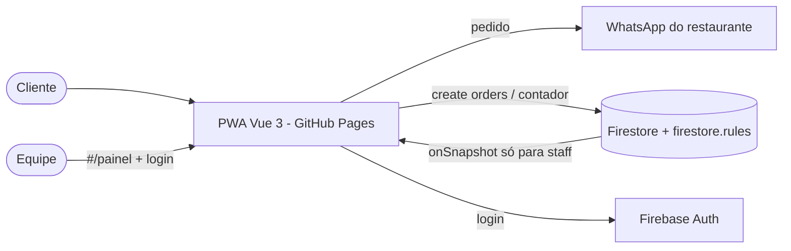
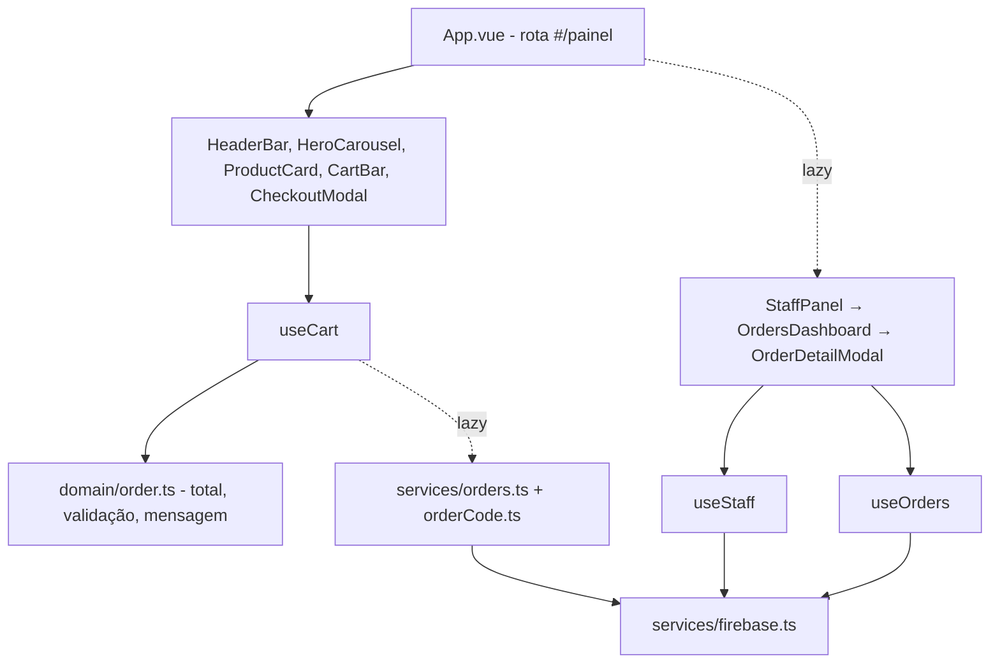

# Arquitetura — Sabor & Churrasco

## Modelo e permissões

| Coleção | Cliente anônimo | Usuário logado | Equipe (`staff/{uid}`) |
|---|---|---|---|
| orders | criar pedido válido | — | ler, mudar status, apagar |
| counters/orders_counter | ler, somar 1 | ler, somar 1 | ler, somar 1 |
| staff | — | ler o próprio | ler o próprio |

## ADRs

| # | Decisão | Motivo | Alternativa |
|---|---|---|---|
| ADR-01 | Painel em `#/painel` com Firebase Auth | Tira dados pessoais da vista do cliente sem novo back-end | Back-end próprio |
| ADR-02 | Equipe definida por documentos em `staff` | Fácil de administrar no console, sem Cloud Functions | Custom claims |
| ADR-03 | Firebase importado sob demanda | Cardápio abre rápido no 4G | Import estático |
| ADR-04 | WhatsApp continua sendo o canal principal | Pedido não se perde se o Firestore falhar | Só Firestore |
| ADR-05 | Documentação do ciclo em `documentacao/` | `docs/` é o build do GitHub Pages | — |
